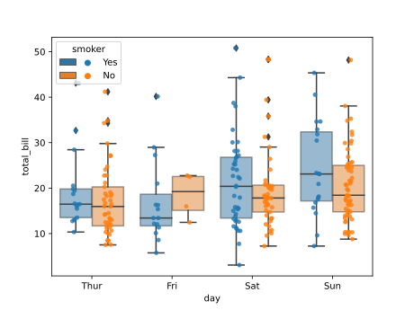
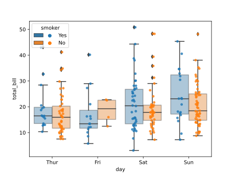
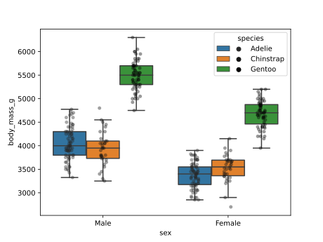

# seabornxt
A few handy extension plots using seaborn API.

## To install:

You can install from PyPI as follows:

``` shell
pip install seabornxt
```

or you can install it from the GitHub repository:

```
git clone https://github.com/LeSasse/seabornxt.git
cd seabornxt
pip install .

```

## Use example:

```
import seaborn as sns
from seabornxt import stripboxplot


def main():
    tips = sns.load_dataset("tips")

    plot = stripboxplot(data=tips, x="day", y="total_bill", hue="smoker")
    fig = plot.get_figure()
    fig.savefig("stripboxplot.pdf")


if __name__ == "__main__":
    main()

```

Results in:



## Customise box and strip plots:

You can customise the box and strip plots by passing over the
`strip_kwargs` and `box_kwargs` dictionaries. The following
example displays data points in the same colour as the box plots:

``` python
import seaborn as sns
from seabornxt import stripboxplot


def main():
    tips = sns.load_dataset("tips")

    plot = stripboxplot(
        data=tips,
        x="day",
        y="total_bill",
        hue="smoker",
        strip_kwargs={"jitter": True, "alpha": 0.8},
        box_kwargs={"boxprops": {"alpha": 0.4}},
    )
    fig = plot.get_figure()
    fig.savefig("stripboxplot_colors.svg")


if __name__ == "__main__":
    main()

```



## Another dataset:

``` python
import seaborn as sns
from seabornxt import stripboxplot


def main():
    penguins = sns.load_dataset("penguins")
    plot = stripboxplot(
        data=penguins,
        x="sex",
        y="body_mass_g",
        hue="species",
    )
    fig = plot.get_figure()
    fig.savefig("stripboxplot_penguins.svg")


if __name__ == "__main__":
    main()

```



