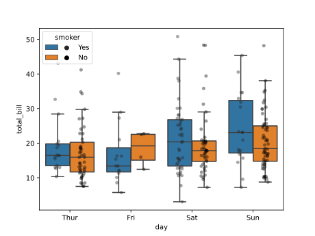

# seabornxt
A few handy extension plots using seaborn API.

To install:

```
git clone https://github.com/LeSasse/seabornxt.git
cd seabornxt
pip install .

```

Use example:

```
import seaborn as sns
from seabornxt import stripboxplot


def main():
    tips = sns.load_dataset("tips")

    plot = stripboxplot(data=tips, x="day", y="total_bill", hue="smoker")
    fig = plot.get_figure()
    fig.savefig("images/stripboxplot.pdf")


if __name__ == "__main__":
    main()

```

Results in:



At the moment, the legend only works properly with this example, will be generalised later on.
